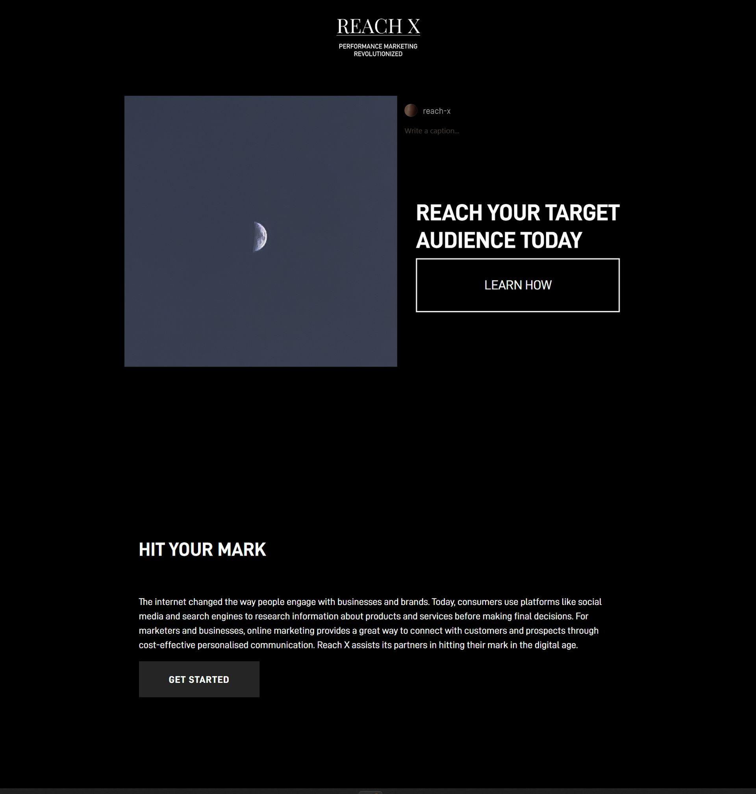

# REACH X Website Re-design

## Project Description
A full website and logo re-design for Reach X marketing company.

## Before Re-design

## Re-designed website [(LINK)](https://smillkaa.github.io/reach-x/)

## Instructions for Re-desgin
Re-design website and logo in my own style.

### Issues Fixed
- The website had not been up updated since 2019. I redesigned it and gave it a modern look that fits today's style standards and expectations such as a clean minimalist style, dark background.
- Uncompleted copywrite of the page made it hard to understand the company's purpose and services from a first impression. I designed a hero image imitating an Instagram post so the first impression would immediately be associated with social media marketing.
- Changed the logo to appear more affluent. 

### Features
- Subtle scroll animation using AOS JavaScript library.
- Contact page introduction animation using JavaScript.
